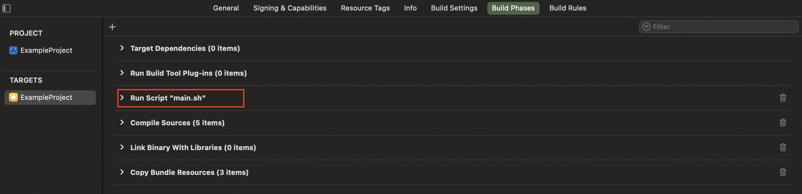

# 使用VersionIcon命令行工具

[TOC]


## 1、图标资源准备

### (1) 准备Ribbons文件夹和Titles文件夹

```
.
├── Ribbons
│   └── Green-TopRight.png
└── Titles
    └── Debug-TopRight.png
```


### (2) 确认Info.plist的版本号和构建号

在工程的Build Settings中，设置`GENERATE_INFOPLIST_FILE`为NO


## 2、集成VersionIcon工具的方式

### (1) Run Script集成




```shell
bash "${PROJECT_DIR}/run_script_version_icon/main.sh"
```


### (2) CocoaPod集成

#### Podfile

```
pod 'VersionIcon', '~> 1.0.8'
```


#### Build Phase

```shell
if [ "${CONFIGURATION}" = "Release" ]; then
    "Pods/VersionIcon/Bin/VersionIcon" --resources "Pods/VersionIcon/Bin" --original
else
    "Pods/VersionIcon/Bin/VersionIcon"  --ribbon Blue-TopRight.png --title Devel-TopRight.png --resources "Pods/VersionIcon/Bin" --strokeWidth 0.07
fi
```


## 3、Xcode调试

见工程ios-version-icon/Package.swift，命令行编译，使用build_command_tool.sh

